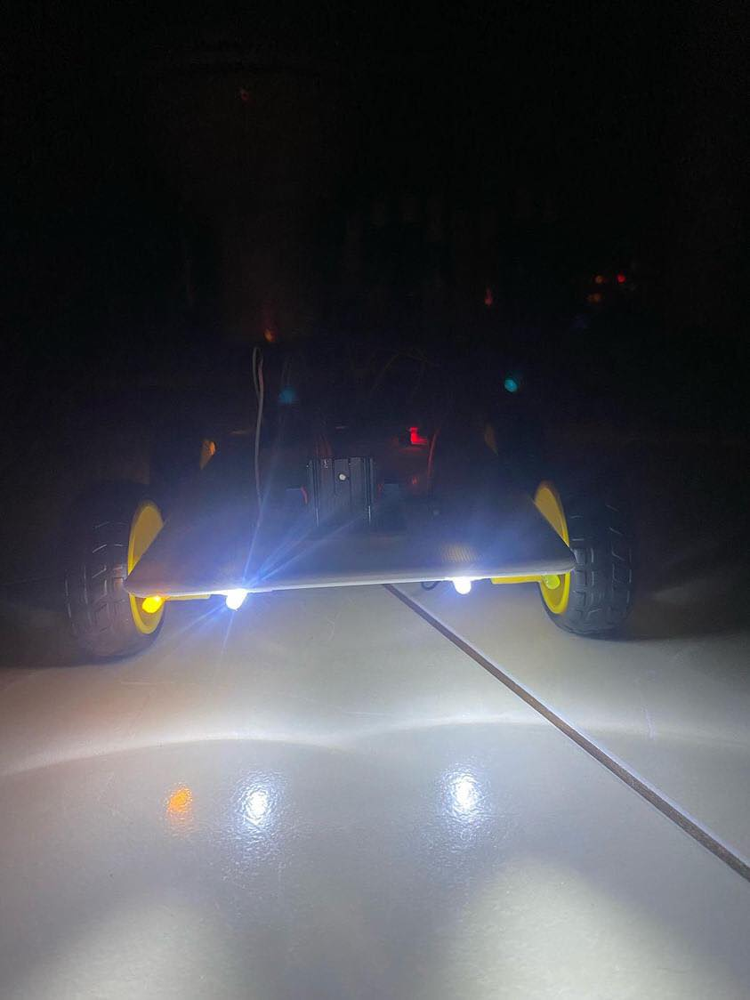
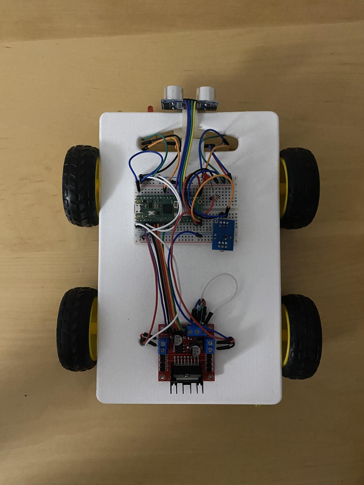
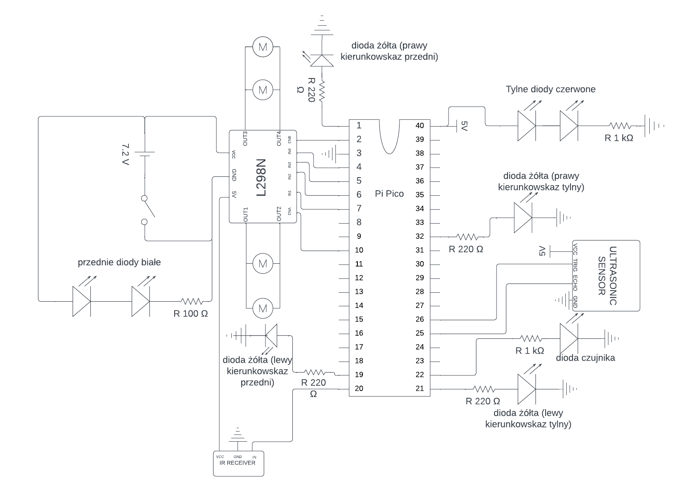
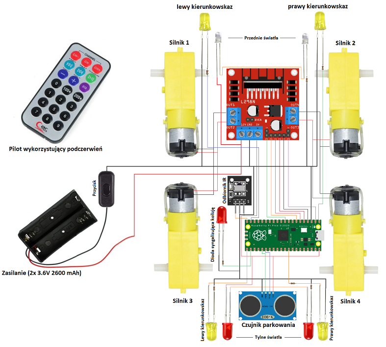

# RemoteControlledCar

## About the project
**RemoteControlledCar** is a project coded in **MicroPython**, a lightweight version of **Python** designed for microcontrollers.

The aim of this project was to create a remote-controlled car by combining knowledge from electronics, programming and also
overall engineering.

  
  
  

This repository contains code responsible for:
* **steering the car** (turning motors on and off)
* **controlling ultrasonic sensor** (parking sensor)
* **controlling LEDs** (car indicators)

These functionalities were achieved with help of library created by Peter Hinch which is available under MIT licence on GitHub: 
https://github.com/peterhinch/micropython_ir/tree/master/ir_rx

that was really helpful when it came to handling signals emited by infrared remote control.

## Schemes

   

    

  
